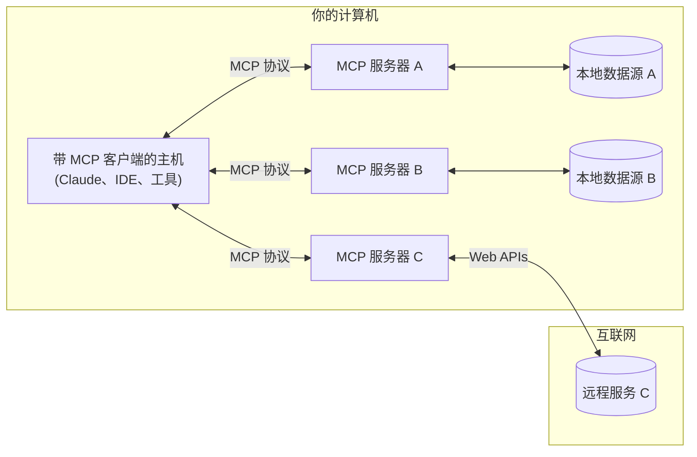

<Note>C# SDK 已发布！查看[最新动态](/development/updates)</Note>

MCP 是一个开放协议，它为应用程序向 LLM 提供上下文的方式进行了标准化。你可以将 MCP 想象成 AI 应用程序的 USB-C 接口。就像 USB-C 为设备连接各种外设和配件提供了标准化的方式一样，MCP 为 AI 模型连接各种数据源和工具提供了标准化的接口。

## 为什么选择 MCP？

MCP 帮助你在 LLM 的基础上构建代理（agents）和复杂的工作流。LLM 经常需要与数据和工具集成，而 MCP 提供了：
- 持续增长的预构建集成列表，LLM 可直接使用
- 灵活切换不同的 LLM 提供商和厂商
- 在你的基础设施内安全地处理数据的最佳实践

### 通用架构

MCP 核心采用客户端-服务器架构，主机应用可以连接多个服务器：

- **MCP Hosts**: 如 Claude Desktop、IDE 或 AI 工具，希望通过 MCP 访问数据的程序
- **MCP Clients**: 维护与服务器一对一连接的协议客户端
- **MCP Servers**: 轻量级程序，通过标准的 Model Context Protocol 提供特定能力
- **本地数据源**: MCP 服务器可安全访问的计算机文件、数据库和服务
- **远程服务**: MCP 服务器可连接的互联网上的外部系统（如通过 APIs）

## 快速开始

选择最适合你的路径：

#### 快速入门
<CardGroup cols={2}>
  <Card
    title="面向服务器开发者"
    icon="bolt"
    href="/quickstart/server"
  >
    开始构建你自己的服务器，供 Claude Desktop 和其他客户端使用
  </Card>
  <Card
    title="面向客户端开发者"
    icon="bolt"
    href="/quickstart/client"
  >
    开始构建你自己的客户端，可与所有 MCP 服务器集成
  </Card>
  <Card
    title="面向 Claude Desktop 用户"
    icon="bolt"
    href="/quickstart/user"
  >
    开始在 Claude Desktop 中使用预构建的服务器
  </Card>
</CardGroup>

#### 示例
<CardGroup cols={2}>
  <Card
    title="服务器示例"
    icon="grid"
    href="/examples"
  >
    查看我们官方 MCP 服务器及实现的示例库
  </Card>
  <Card
    title="客户端示例"
    icon="cubes"
    href="/clients"
  >
    查看支持 MCP 集成的客户端列表
  </Card>
</CardGroup>

## 教程

<CardGroup cols={2}>
  <Card
    title="使用 LLM 构建 MCP"
    icon="comments"
    href="/tutorials/building-mcp-with-llms"
  >
    学习如何使用 Claude 等 LLM 来加快你的 MCP 开发
  </Card>
  <Card
  title="Debug 指南"
  icon="bug"
  href="/docs/tools/debugging">
    学习如何有效地调试 MCP 服务器和集成
  </Card>
  <Card
    title="MCP Inspector"
    icon="magnifying-glass"
    href="/docs/tools/inspector"
  >
    使用我们的交互式调试工具测试和检查你的 MCP 服务器
  </Card>
  <Card
    title="MCP 工作坊（视频，2 小时）"
    icon="person-chalkboard"
    href="https://www.youtube.com/watch?v=kQmXtrmQ5Zg"
  >
    <iframe src="https://www.youtube.com/embed/kQmXtrmQ5Zg"> </iframe>
  </Card>
</CardGroup>

## 探索 MCP

深入了解 MCP 的核心概念和功能：

<CardGroup cols={2}>
  <Card
    title="核心架构"
    icon="sitemap"
    href="/docs/concepts/architecture"
  >
    了解 MCP 如何连接客户端、服务器和 LLM
  </Card>
  <Card
    title="Resources"
    icon="database"
    href="/docs/concepts/resources"
  >
    从你的服务器向 LLM 暴露数据和内容
  </Card>
  <Card
    title="Prompts"
    icon="message"
    href="/docs/concepts/prompts"
  >
    创建可复用的提示模板和工作流
  </Card>
  <Card
    title="Tools"
    icon="wrench"
    href="/docs/concepts/tools"
  >
    让 LLM 通过你的服务器执行操作
  </Card>
  <Card
    title="Sampling"
    icon="robot"
    href="/docs/concepts/sampling"
  >
    让你的服务器向 LLM 请求补全
  </Card>
  <Card
    title="传输层"
    icon="network-wired"
    href="/docs/concepts/transports"
  >
    了解 MCP 的通信机制
  </Card>
</CardGroup>

## 贡献

想参与贡献？查看我们的[贡献指南](/development/contributing)，了解如何帮助改进 MCP。

## 支持和反馈

以下是如何获得帮助或提供反馈的途径：

- 针对 MCP 规范、SDK 或文档（开源）的错误报告和功能请求，请[创建 GitHub issue](https://github.com/modelcontextprotocol)
- 针对 MCP 规范的讨论或问答，请使用[规范讨论区](https://github.com/modelcontextprotocol/specification/discussions)
- 针对其他 MCP 开源组件的讨论或问答，请使用[组织讨论区](https://github.com/orgs/modelcontextprotocol/discussions)
- 针对 Claude.app 和 claude.ai 的 MCP 集成相关的错误报告、功能请求和问题，请参阅 Anthropic 的指南：[如何获取支持](https://support.anthropic.com/en/articles/9015913-how-to-get-support)
