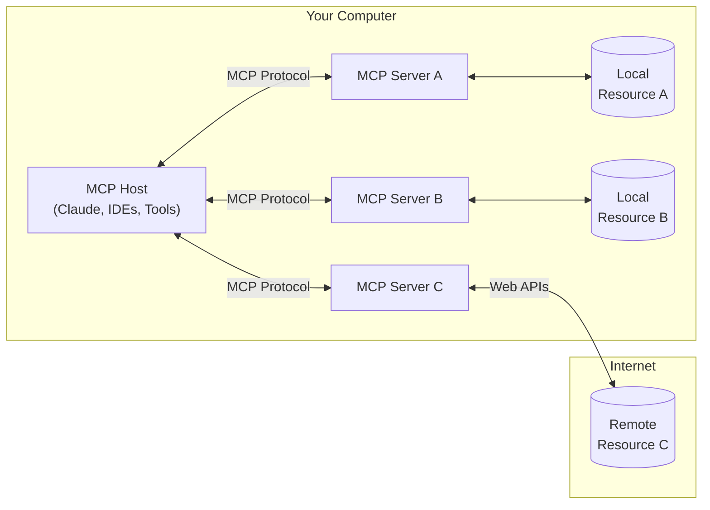
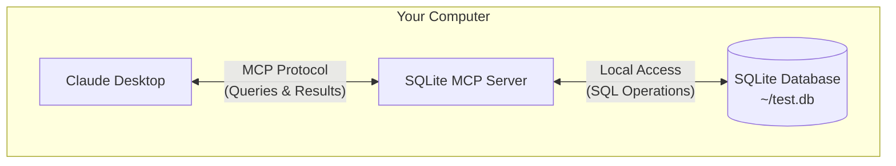

MCP 是一个协议，它可以在 host 应用（如 [Claude Desktop](https://claude.ai/download)）和本地服务之间建立安全连接。在本快速入门指南中，你将学习如何：

- 设置本地 SQLite 数据库
- 通过 MCP 将 Claude Desktop 连接到该数据库
- 安全地查询和分析你的数据

<Note>
虽然本指南侧重于使用 Claude Desktop 作为 MCP 主机示例，但该协议是开放的，可以被任何应用程序集成。IDE、AI 工具和其他软件都可以使用 MCP 以标准化的方式连接到本地集成。
</Note>

<Warning>
Claude Desktop 的 MCP 支持目前处于开发者预览阶段，仅支持连接到运行在你机器上的本地 MCP 服务器。尚不支持远程 MCP 连接。此集成仅在 Claude Desktop 应用程序中可用，而不适用于 Claude 的网页界面 (claude.ai)。
</Warning>

## MCP 如何工作

MCP (Model Context Protocol) 是一个开放协议，它可以在 AI 应用程序与本地或远程资源之间实现安全、受控的交互。让我们来解析一下它的工作原理，然后看看我们将在本指南中如何使用它。

### 通用架构
MCP 的核心是一个 client-server 架构，host 应用程序可以连接到多个服务器：



- **MCP Hosts**: 像 Claude Desktop、IDEs 或 AI 工具这样的程序，它们希望通过 MCP 访问资源
- **MCP Clients**: 维护与服务器 1:1 连接的协议客户端
- **MCP Servers**: 轻量级程序，通过标准化的 Model Context Protocol 暴露特定功能
- **Local Resources**: 你的计算机资源（数据库、文件、服务），MCP 服务器可以安全地访问这些资源
- **Remote Resources**: 通过互联网可用的资源（例如，通过 APIs），MCP 服务器可以连接到这些资源

### 在本指南中

对于本快速入门，我们将使用 SQLite 实现一个集中示例：



1. Claude Desktop 作为我们的 MCP 客户端
2. 一个 SQLite MCP 服务器提供安全的数据库访问
3. 你的本地 SQLite 数据库存储实际数据

SQLite MCP 服务器和你的本地 SQLite 数据库之间的通信完全发生在你的机器上 &mdash; 你的 SQLite 数据库不会暴露在互联网上。Model Context Protocol 确保 Claude Desktop 只能通过定义良好的接口执行批准的数据库操作。这为你提供了一种安全的方式，让 Claude 分析和交互你的本地数据，同时完全控制它可以访问的内容。

## 前提条件

- macOS 或 Windows
- 安装最新版本的 [Claude Desktop](https://claude.ai/download)
- [uv](https://docs.astral.sh/uv/) 0.4.18 或更高版本（`uv --version` 检查）
- Git（`git --version` 检查）
- SQLite（`sqlite3 --version` 检查）

<AccordionGroup>
  <Accordion title="安装前提条件 (macOS)">
  ```bash
  # 使用 Homebrew
  brew install uv git sqlite3

  # 或直接下载：
  # uv: https://docs.astral.sh/uv/
  # Git: https://git-scm.com
  # SQLite: https://www.sqlite.org/download.html
  ```
  </Accordion>
  <Accordion title="安装前提条件 (Windows)">
  ```powershell
  # 使用 winget
  winget install --id=astral-sh.uv -e
  winget install git.git sqlite.sqlite

  # 或直接下载：
  # uv: https://docs.astral.sh/uv/
  # Git: https://git-scm.com
  # SQLite: https://www.sqlite.org/download.html
  ```
  </Accordion>
</AccordionGroup>

## 安装

<Tabs>
  <Tab title="macOS">
    <Steps>
      <Step title="创建示例数据库">
        创建一个简单的 SQLite 数据库进行测试：

        ```bash
        # 创建一个新的 SQLite 数据库
        sqlite3 ~/test.db <<EOF
        CREATE TABLE products (
          id INTEGER PRIMARY KEY,
          name TEXT,
          price REAL
        );

        INSERT INTO products (name, price) VALUES
          ('Widget', 19.99),
          ('Gadget', 29.99),
          ('Gizmo', 39.99),
          ('Smart Watch', 199.99),
          ('Wireless Earbuds', 89.99),
          ('Portable Charger', 24.99),
          ('Bluetooth Speaker', 79.99),
          ('Phone Stand', 15.99),
          ('Laptop Sleeve', 34.99),
          ('Mini Drone', 299.99),
          ('LED Desk Lamp', 45.99),
          ('Keyboard', 129.99),
          ('Mouse Pad', 12.99),
          ('USB Hub', 49.99),
          ('Webcam', 69.99),
          ('Screen Protector', 9.99),
          ('Travel Adapter', 27.99),
          ('Gaming Headset', 159.99),
          ('Fitness Tracker', 119.99),
          ('Portable SSD', 179.99);
        EOF
        ```
      </Step>

      <Step title="配置 Claude Desktop">
        在文本编辑器中打开 `~/Library/Application Support/Claude/claude_desktop_config.json` 中的 Claude Desktop 应用配置。

        例如，如果你安装了 [VS Code](https://code.visualstudio.com/)：

        ```bash
        code ~/Library/Application\ Support/Claude/claude_desktop_config.json
        ```

        添加以下配置（将 YOUR_USERNAME 替换为你的实际用户名）：

        ```json
        {
          "mcpServers": {
            "sqlite": {
              "command": "uvx",
              "args": ["mcp-server-sqlite", "--db-path", "/Users/YOUR_USERNAME/test.db"]
            }
          }
        }
        ```

        这告诉 Claude Desktop：
        1. 有一个名为 "sqlite" 的 MCP 服务器
        2. 通过运行 `uvx mcp-server-sqlite` 启动它
        3. 将其连接到你的测试数据库

        保存文件，并重新启动 **Claude Desktop**。
      </Step>
    </Steps>
  </Tab>
  <Tab title="Windows">
    <Steps>
      <Step title="创建示例数据库">
        创建一个简单的 SQLite 数据库进行测试：

        ```powershell
        # 创建一个新的 SQLite 数据库
        $sql = @'
        CREATE TABLE products (
          id INTEGER PRIMARY KEY,
          name TEXT,
          price REAL
        );

        INSERT INTO products (name, price) VALUES
          ('Widget', 19.99),
          ('Gadget', 29.99),
          ('Gizmo', 39.99),
          ('Smart Watch', 199.99),
          ('Wireless Earbuds', 89.99),
          ('Portable Charger', 24.99),
          ('Bluetooth Speaker', 79.99),
          ('Phone Stand', 15.99),
          ('Laptop Sleeve', 34.99),
          ('Mini Drone', 299.99),
          ('LED Desk Lamp', 45.99),
          ('Keyboard', 129.99),
          ('Mouse Pad', 12.99),
          ('USB Hub', 49.99),
          ('Webcam', 69.99),
          ('Screen Protector', 9.99),
          ('Travel Adapter', 27.99),
          ('Gaming Headset', 159.99),
          ('Fitness Tracker', 119.99),
          ('Portable SSD', 179.99);
        '@

        cd ~
        & sqlite3 test.db $sql
        ```
      </Step>

      <Step title="配置 Claude Desktop">
        在文本编辑器中打开 `%APPDATA%\Claude\claude_desktop_config.json` 中的 Claude Desktop 应用配置。

        例如，如果你安装了 [VS Code](https://code.visualstudio.com/)：

        ```powershell
        code $env:AppData\Claude\claude_desktop_config.json
        ```

        添加以下配置（将 YOUR_USERNAME 替换为你的实际用户名）：

        ```json
        {
          "mcpServers": {
            "sqlite": {
              "command": "uvx",
              "args": [
                "mcp-server-sqlite",
                "--db-path",
                "C:\\Users\\YOUR_USERNAME\\test.db"
              ]
            }
          }
        }
        ```

        这告诉 Claude Desktop：
        1. 有一个名为 "sqlite" 的 MCP 服务器
        2. 通过运行 `uvx mcp-server-sqlite` 启动它
        3. 将其连接到你的测试数据库

        保存文件，并重新启动 **Claude Desktop**。
      </Step>
    </Steps>
  </Tab>
</Tabs>

## 测试

让我们验证一切正常。尝试向 Claude Desktop 发送以下提示：

```
你能连接到我的 SQLite 数据库并告诉我有哪些产品及其价格吗？
```

Claude Desktop 将会：
1. 连接到 SQLite MCP 服务器
2. 查询你的本地数据库
3. 格式化并展示结果

<Frame caption="Claude Desktop 成功查询我们的 SQLite 数据库 🎉">
  
</Frame>

## 背后发生了什么？

当你使用 MCP 与 Claude Desktop 交互时：

1. **服务器发现**：Claude Desktop 在启动时连接到你配置的 MCP 服务器
2. **协议握手**：当你询问数据时，Claude Desktop：
   - 确定哪个 MCP 服务器可以提供帮助（在本例中是 sqlite）
   - 通过协议协商能力
   - 从 MCP 服务器请求数据或操作

3. **交互流程**：
   ```mermaid
   sequenceDiagram
       participant C as Claude Desktop
       participant M as MCP Server
       participant D as SQLite DB

       C->>M: 初始化连接
       M-->>C: 可用的能力

       C->>M: 查询请求
       M->>D: SQL 查询
       D-->>M: 结果
       M-->>C: 格式化结果
   ```

4. **安全性**：
   - MCP 服务器仅暴露特定、受控的功能
   - MCP 服务器在你的机器上本地运行，它们访问的资源不会暴露在互联网上
   - Claude Desktop 需要用户确认以进行敏感操作

## 尝试这些示例

现在 MCP 正常工作，尝试这些越来越强大的示例：

<AccordionGroup>
  <Accordion title="基本查询" active>
    ```
    数据库中所有产品的平均价格是多少？
    ```
  </Accordion>
  <Accordion title="数据分析">
    ```
    你能分析价格分布并建议任何定价优化吗？
    ```
  </Accordion>
  <Accordion title="复杂操作">
    ```
    你能帮我设计并创建一个新表来存储客户订单吗？
    ```
  </Accordion>
</AccordionGroup>

## 添加更多功能

想给 Claude Desktop 更多本地集成功能？将这些服务器添加到你的配置中：

<Note>
  请注意，这些 MCP 服务器需要在你的机器上安装 [Node.js](https://nodejs.org/en)。
</Note>

<AccordionGroup>
  <Accordion title="文件系统访问" icon="folder-open">
    添加此配置以让 Claude Desktop 读取和分析文件：
    ```json
    "filesystem": {
      "command": "npx",
      "args": ["-y", "@modelcontextprotocol/server-filesystem", "/Users/YOUR_USERNAME/Desktop"]
    }
    ```
  </Accordion>

  <Accordion title="PostgreSQL 连接" icon="database">
    将 Claude Desktop 连接到你的 PostgreSQL 数据库：
    ```json
    "postgres": {
      "command": "npx",
      "args": ["-y", "@modelcontextprotocol/server-postgres", "postgresql://localhost/mydb"]
    }
    ```
  </Accordion>
</AccordionGroup>

## 更多 MCP 客户端

虽然本指南演示了使用 Claude Desktop 作为客户端的 MCP，但还有其他支持 MCP 集成的应用程序：

<CardGroup cols={2}>
  <Card
    title="Zed Editor"
    icon="pen-to-square"
    href="https://zed.dev">
    一个高性能的、多用户代码编辑器，内置 MCP 支持以实现 AI 驱动的代码辅助
  </Card>

  <Card
    title="Cody"
    icon="magnifying-glass"
    href="https://sourcegraph.com/cody">
    代码智能平台，具有 MCP 集成功能，以增强代码搜索和分析能力
  </Card>
</CardGroup>

每个主机应用程序可能以不同的方式实现 MCP 功能或支持不同的功能。请查看它们各自的文档以获取特定的设置说明和支持的功能。

## 故障排除

<AccordionGroup>
  <Accordion title="Claude Desktop 中没有显示任何内容？">
    1. 检查 MCP 是否已启用：
       - 点击 Claude Desktop 中的 🔌 图标，位于聊天框旁边
       - 展开“已安装的 MCP 服务器”
       - 你应该能看到你配置的服务器

    2. 验证你的配置：
       - 在 Claude Desktop 中，进入 Claude > 设置…
       - 打开“开发者”选项卡查看你的配置

    3. 完全重启 Claude Desktop：
       - 退出应用程序（不仅仅是关闭窗口）
       - 再次启动
  </Accordion>

  <Accordion title="MCP 或数据库错误？">
    1. 检查 Claude Desktop 的日志：
       ```bash
       tail -n 20 -f ~/Library/Logs/Claude/mcp*.log
       ```

    2. 验证数据库访问：
       ```bash
       # 测试数据库连接
       sqlite3 ~/test.db ".tables"
       ```

    3. 常见修复：
       - 检查配置中的文件路径
       - 验证数据库文件权限
       - 确保 SQLite 安装正确
  </Accordion>
</AccordionGroup>

## 下一步

<CardGroup cols={2}>
  <Card title="构建你的第一个 MCP 服务器" icon="code" href="/docs/first-server/python">
    创建你自己的 MCP 服务器，为你的 LLM 客户端提供新功能。
  </Card>

  <Card title="探索示例" icon="github" href="https://github.com/modelcontextprotocol/servers">
    浏览我们的示例服务器集合，看看有什么可能。
  </Card>
</CardGroup>
